# 🚀 AI-SDK ECOSYSTEM

<p align="center">
  <b>10 Production-Ready AI SDK Framework Implementations</b>
</p>

<p align="center">
  <a href="https://github.com/mk-knight23/AI-SDK-ECOSYSTEM/actions/workflows/ci.yml">
    
  </a>
  
  
  
  
</p>

<p align="center">
  <a href="https://mk-knight23.github.io/AI-SDK-ECOSYSTEM/">
    
  </a>
</p>

<p align="center">
  A comprehensive showcase demonstrating 10 different AI SDK integrations across
  production-ready projects. Each project combines modern frameworks with
  cutting-edge AI capabilities.
</p>

---

## 📊 Repository Status

### Overall

| Metric | Status |
|--------|--------|
| **CI/CD** |  |
| **License** |  |
| **Maintenance** |  |
| **Last Updated** | 2026-02-24 |

### Projects (10)

| # | Project | Status |
|---|---------|--------|
| 1 | AI-SDK-LANGCHAIN |  |
| 2 | AI-SDK-CREWAI |  |
| 3 | AI-SDK-LANGGRAPH |  |
| 4 | AI-SDK-AUTOGEN |  |
| 5 | AI-SDK-OPENAI |  |
| 6 | AI-SDK-VERCEL-AI |  |
| 7 | AI-SDK-ANTHROPIC |  |
| 8 | AI-SDK-HAYSTACK |  |
| 9 | AI-SDK-SEMANTIC-KERNEL |  |
| 10 | AI-SDK-LAMA-INDEX |  |

### AI SDK Integrations

<p align="left">
  <a href="https://github.com/langchain-ai/langchain">
    
  </a>
  <a href="https://github.com/joaomdmoura/crewAI">
    
  </a>
  <a href="https://github.com/langchain-ai/langgraph">
    
  </a>
  <a href="https://github.com/microsoft/autogen">
    
  </a>
  <a href="https://github.com/openai/openai-quickstart-python">
    
  </a>
  <a href="https://sdk.vercel.ai/">
    
  </a>
  <a href="https://github.com/anthropics/anthropic-sdk-python">
    
  </a>
  <a href="https://github.com/deepset-ai/haystack">
    
  </a>
  <a href="https://github.com/microsoft/semantic-kernel">
    
  </a>
  <a href="https://github.com/run-llama/llama_index">
    
  </a>
</p>

### Framework Stack

<p align="left">
  
  
  
  
  
  
  
  
  
  
  
  
</p>

### Deployment Platforms

<p align="left">
  
  
  
  
</p>

### Community


---

## 🚀 Quick Navigation

| 🚀 Quick Start | 📚 Projects | 🔧 Setup |
|---------------|-------------|----------|
| Get started in 5 minutes | Explore all 10 projects | Full installation guide |

| 🤖 AI SDKs | 📖 Docs | 🤝 Contributing |
|------------|---------|----------------|
| Integration details | Documentation | Join the community |

---

## 📖 About

### What

The **AI-SDK Ecosystem** is a comprehensive showcase of 10 independent, production-ready GitHub repositories. Each repository demonstrates a complete implementation of a popular AI/ML SDK framework with modern web technologies.

### Why

- 📚 **Learn:** See real-world AI SDK implementations
- 🔀 **Fork:** Use as starter templates for your projects
- 🤝 **Contribute:** Help improve the implementations
- 🚀 **Deploy:** Each project is deployment-ready

### How

Built using independent repository architecture with consistent patterns, comprehensive documentation, and test-driven development throughout.

### Timeline

- **Week 1:** Created 10 independent GitHub repositories with modern tech stacks
- **Week 2:** Integrated 10 different AI SDKs with functional endpoints
- **Future:** Add comprehensive tests, deployment guides, and more examples

---

## 🎯 Projects Overview

| Project | Stack | AI SDK | Platform | Status | Links |
|---------|-------|--------|----------|--------|-------|
| 🦜 AI-SDK-LANGCHAIN | [Next.js 15] + [FastAPI] | [LangChain] | Railway |  | [Demo](https://mk-knight23.github.io/AI-SDK-ECOSYSTEM/) [Repo](https://github.com/mk-knight23/AI-SDK-LANGCHAIN) |
| 👥 AI-SDK-CREWAI | [React 19] + [FastAPI] | [CrewAI] | Render |  | [Demo](https://mk-knight23.github.io/AI-SDK-ECOSYSTEM/) [Repo](https://github.com/mk-knight23/AI-SDK-CREWAI) |
| 🕸️ AI-SDK-LANGGRAPH | [SvelteKit] + [Node.js] | [LangGraph] | Fly.io |  | [Demo](https://mk-knight23.github.io/AI-SDK-ECOSYSTEM/) [Repo](https://github.com/mk-knight23/AI-SDK-LANGGRAPH) |
| 🤖 AI-SDK-AUTOGEN | [Vue 3] + [.NET 9] | [AutoGen] | Azure |  | [Demo](https://mk-knight23.github.io/AI-SDK-ECOSYSTEM/) [Repo](https://github.com/mk-knight23/AI-SDK-AUTOGEN) |
| 🟢 AI-SDK-OPENAI | [Angular 19] + [Go] | [OpenAI] | GCP |  | [Demo](https://mk-knight23.github.io/AI-SDK-ECOSYSTEM/) [Repo](https://github.com/mk-knight23/AI-SDK-OPENAI) |
| ▲ AI-SDK-VERCEL-AI | [Next.js 15 RSC] | [Vercel AI SDK] | Vercel |  | [Demo](https://mk-knight23.github.io/AI-SDK-ECOSYSTEM/) [Repo](https://github.com/mk-knight23/AI-SDK-VERCEL-AI) |
| 🧠 AI-SDK-ANTHROPIC | [Remix] + [FastAPI] | [Anthropic] | Fly.io |  | [Demo](https://mk-knight23.github.io/AI-SDK-ECOSYSTEM/) [Repo](https://github.com/mk-knight23/AI-SDK-ANTHROPIC) |
| 🌾 AI-SDK-HAYSTACK | [Nuxt 3] + [Django] | [Haystack] | Render |  | [Demo](https://mk-knight23.github.io/AI-SDK-ECOSYSTEM/) [Repo](https://github.com/mk-knight23/AI-SDK-HAYSTACK) |
| 🎯 AI-SDK-SEMANTIC-KERNEL | [Astro 5] + [Flask] | [Semantic Kernel] | AWS |  | [Demo](https://mk-knight23.github.io/AI-SDK-ECOSYSTEM/) [Repo](https://github.com/mk-knight23/AI-SDK-SEMANTIC-KERNEL) |
| 🦙 AI-SDK-LAMA-INDEX | [T3 Stack] + [FastAPI] | [LlamaIndex] | Fly.io |  | [Demo](https://mk-knight23.github.io/AI-SDK-ECOSYSTEM/) [Repo](https://github.com/mk-knight23/AI-SDK-LAMA-INDEX) |

---

## 🚀 Quick Start

### Prerequisites

- Node.js 18+ (ideally 20) and Python 3.12+
- Docker (optional, for containerized development)
- Git (for cloning repositories)

### Clone & Install

```bash
# Clone the repository
git clone https://github.com/mk-knight23/AI-SDK-ECOSYSTEM.git
cd AI-SDK-ECOSYSTEM

# View the live showcase
open index.html
```

### Run Individual Projects

```bash
# Example: Clone and run AI-SDK-LANGCHAIN
git clone https://github.com/mk-knight23/AI-SDK-LANGCHAIN.git
cd AI-SDK-LANGCHAIN

# Backend (Python)
cd backend
python -m venv venv
source venv/bin/activate  # On Windows: venv\Scripts\activate
pip install -r requirements.txt
uvicorn main:app --reload

# Frontend (Next.js)
cd ../frontend
npm install
npm run dev
```

### Verify Services

```bash
# Check backend health
curl http://localhost:8000/health

# Expected response:
# {"status":"ok","version":"1.0.0"}
```

---

## 🏗️ Architecture

### Project Structure

```
AI-SDK-ECOSYSTEM/
├── AI-SDK-LANGCHAIN/         # LangChain + Next.js + FastAPI
├── AI-SDK-CREWAI/           # CrewAI + React + FastAPI
├── AI-SDK-LANGGRAPH/        # LangGraph + SvelteKit + Node.js
├── AI-SDK-AUTOGEN/          # AutoGen + Vue + .NET
├── AI-SDK-OPENAI/           # OpenAI + Angular + Go
├── AI-SDK-VERCEL-AI/        # Vercel AI SDK + Next.js
├── AI-SDK-ANTHROPIC/        # Anthropic + Remix + FastAPI
├── AI-SDK-HAYSTACK/         # Haystack + Nuxt + Django
├── AI-SDK-SEMANTIC-KERNEL/  # Semantic Kernel + Astro + Flask
├── AI-SDK-LAMA-INDEX/       # LlamaIndex + T3 Stack + FastAPI
├── docs/                    # Documentation
├── index.html               # Live showcase
└── README.md                # This file
```

### System Overview

```mermaid
graph TD
    Hub[AI-SDK-ECOSYSTEM Hub]
    P1[AI-SDK-LANGCHAIN<br/>Next.js + FastAPI]
    P2[AI-SDK-CREWAI<br/>React + FastAPI]
    P3[AI-SDK-LANGGRAPH<br/>SvelteKit + Node.js]
    P4[AI-SDK-AUTOGEN<br/>Vue + .NET]
    P5[AI-SDK-OPENAI<br/>Angular + Go]
    P6[AI-SDK-VERCEL-AI<br/>Next.js RSC]
    P7[AI-SDK-ANTHROPIC<br/>Remix + FastAPI]
    P8[AI-SDK-HAYSTACK<br/>Nuxt + Django]
    P9[AI-SDK-SEMANTIC-KERNEL<br/>Astro + Flask]
    P10[AI-SDK-LAMA-INDEX<br/>T3 Stack + FastAPI]

    Hub --> P1
    Hub --> P2
    Hub --> P3
    Hub --> P4
    Hub --> P5
    Hub --> P6
    Hub --> P7
    Hub --> P8
    Hub --> P9
    Hub --> P10

    style Hub fill:#4f46e5,stroke:#333,stroke-width:4px,color:#fff
    style P1 fill:#000,stroke:#333,color:#fff
    style P2 fill:#61dafb,stroke:#333
    style P3 fill:#ff3e00,stroke:#333,color:#fff
    style P4 fill:#4fc08d,stroke:#333
    style P5 fill:#dd0031,stroke:#333,color:#fff
    style P6 fill:#000,stroke:#333,color:#fff
    style P7 fill:#000,stroke:#333,color:#fff
    style P8 fill:#00dc82,stroke:#333
    style P9 fill:#ff5d01,stroke:#333,color:#fff
    style P10 fill:#2563eb,stroke:#333,color:#fff
```



---

## 🤖 AI SDK Integrations

### 1. AI-SDK-LANGCHAIN - LangChain
**Feature:** Stateful multi-agent applications with cyclic graph topology
**Stack:** Next.js 15 + FastAPI + PostgreSQL + Redis
**Endpoints:** `/api/agent/execute`, `/api/agent/stream`, `/health`
**Test:** `curl localhost:8000/health`

### 2. AI-SDK-CREWAI - CrewAI
**Feature:** Multi-agent orchestration with role-based AI teams
**Stack:** React 19 + FastAPI + CrewAI
**Endpoints:** `/tasks/execute`, `/tasks/sequential`, `/tasks/hierarchical`
**Test:** `curl -X POST localhost:8000/tasks/execute -d '{"task":"research","agent":"researcher"}'`

### 3. AI-SDK-LANGGRAPH - LangGraph
**Feature:** Stateful multi-agent systems with graph-based workflows
**Stack:** SvelteKit 2 + Node.js 20
**Endpoints:** `/api/graph/execute`, `/api/graph/state`, `/api/stream`
**Test:** `curl localhost:8000/api/graph/state`

### 4. AI-SDK-AUTOGEN - AutoGen
**Feature:** Conversational multi-agent systems with auto-reply patterns
**Stack:** Vue 3 + .NET 9
**Endpoints:** `/api/chat`, `/api/agents`, `/api/stream`
**Test:** `curl -X POST localhost:8080/api/chat -d '{"message":"Hello"}'`

### 5. AI-SDK-OPENAI - OpenAI
**Feature:** Official OpenAI SDK with TypeScript/Go implementations
**Stack:** Angular 19 + Go 1.22
**Endpoints:** `/api/chat`, `/api/completions`, `/api/embeddings`
**Test:** `curl -X POST localhost:8080/api/chat -d '{"model":"gpt-4","messages":[{"role":"user","content":"Hi"}]}'`

### 6. AI-SDK-VERCEL-AI - Vercel AI SDK
**Feature:** Streaming generative UI with unified provider interface
**Stack:** Next.js 15 RSC + Vercel AI SDK
**Endpoints:** `/api/chat`, `/api/stream`, `/api/generate`
**Test:** `curl -N localhost:3000/api/chat -d '{"messages":[{"role":"user","content":"Hi"}]}'`

### 7. AI-SDK-ANTHROPIC - Anthropic
**Feature:** Claude API integration with advanced prompt engineering
**Stack:** Remix 2 + FastAPI
**Endpoints:** `/api/completions`, `/api/chat`, `/api/stream`
**Test:** `curl -X POST localhost:8000/api/completions -d '{"model":"claude-3-sonnet","prompt":"Hi"}'`

### 8. AI-SDK-HAYSTACK - Haystack
**Feature:** Production-ready NLP and LLM orchestration
**Stack:** Nuxt 3 + Django 5
**Endpoints:** `/api/query`, `/api/index`, `/api/search`
**Test:** `curl -X POST localhost:8000/api/query -d '{"query":"test"}'`

### 9. AI-SDK-SEMANTIC-KERNEL - Semantic Kernel
**Feature:** Microsoft's AI orchestration framework
**Stack:** Astro 5 + Flask 3
**Endpoints:** `/api/chat`, `/api/function-call`, `/api/plugin`
**Test:** `curl -X POST localhost:5000/api/chat -d '{"message":"Hi"}'`

### 10. AI-SDK-LAMA-INDEX - LlamaIndex
**Feature:** Data framework for LLM applications
**Stack:** T3 Stack + FastAPI
**Endpoints:** `/api/query`, `/api/index`, `/api/rag`
**Test:** `curl -X POST localhost:8000/api/query -d '{"query":"test"}'`

---

## 🔧 Setup & Installation

### For Developers

#### 1. Fork & Clone

```bash
# Fork on GitHub, then clone
git clone https://github.com/YOUR_USERNAME/AI-SDK-ECOSYSTEM.git
cd AI-SDK-ECOSYSTEM
```

#### 2. Choose a Project

```bash
# Navigate to the project you want to work with
cd AI-SDK-LANGCHAIN  # or any other project
```

#### 3. Install Dependencies

```bash
# Frontend dependencies
cd frontend
npm install

# Backend dependencies (if Python)
cd ../backend
python -m venv venv
source venv/bin/activate  # On Windows: venv\Scripts\activate
pip install -r requirements.txt
```

#### 4. Environment Variables

```bash
# Copy environment template
cp .env.example .env

# Edit with your API keys
# OPENAI_API_KEY=sk-...
# ANTHROPIC_API_KEY=sk-ant-...
```

#### 5. Run Locally

```bash
# Start backend
cd backend
uvicorn main:app --reload

# Start frontend (in new terminal)
cd frontend
npm run dev
```

### For Contributors

See [Contributing](#-contributing) section below for:
- Development setup
- Code style guidelines
- Commit conventions
- Testing requirements
- PR process

---

## 💡 Usage Examples

### Testing AI Endpoints

```bash
# LangChain - Agent execution
curl -X POST http://localhost:8000/api/agent/execute \
  -H "Content-Type: application/json" \
  -d '{"input": "What is the capital of France?", "agent_type": "researcher"}'

# CrewAI - Task execution
curl -X POST http://localhost:8000/tasks/execute \
  -H "Content-Type: application/json" \
  -d '{"task": "Research AI developments", "agent": "researcher"}'

# OpenAI - Chat completion
curl -X POST http://localhost:8080/api/chat \
  -H "Content-Type: application/json" \
  -H "Authorization: Bearer YOUR_API_KEY" \
  -d '{"model": "gpt-4", "messages": [{"role": "user", "content": "Hello!"}]}'

# Anthropic - Claude completion
curl -X POST http://localhost:8000/api/completions \
  -H "Content-Type: application/json" \
  -H "x-api-key: YOUR_API_KEY" \
  -d '{"model": "claude-3-sonnet-20240229", "prompt": "Hello, how are you?", "max_tokens": 100}'

# Vercel AI SDK - Streaming response
curl -N http://localhost:3000/api/chat \
  -H "Content-Type: application/json" \
  -d '{"messages": [{"role": "user", "content": "Tell me a joke"}]}'
```

### Frontend API Call Example

```typescript
// Generic API client
async function callAPI<T>(endpoint: string, data?: unknown): Promise<T> {
  const response = await fetch(endpoint, {
    method: data ? 'POST' : 'GET',
    headers: {
      'Content-Type': 'application/json',
    },
    body: data ? JSON.stringify(data) : undefined,
  });

  if (!response.ok) {
    throw new Error(`API error: ${response.statusText}`);
  }

  return response.json();
}

// Usage
const result = await callAPI<{ response: string }>('/api/agent/execute', {
  input: 'What is AI?',
  agent_type: 'researcher',
});
```

---

## 📚 Documentation

- **[Live Showcase](https://mk-knight23.github.io/AI-SDK-ECOSYSTEM/)** - Interactive project showcase
- **[Individual Project READMEs](#-ai-sdk-integrations)** - Detailed project documentation
- **[Architecture Docs](#-architecture)** - System architecture diagrams
- **[API Documentation](#-ai-sdk-integrations)** - Endpoint references

---

## 🤝 Contributing

We welcome contributions! Here's how you can help:

### Quick Summary

1. Fork the repository
2. Create a feature branch (`git checkout -b feature/amazing-feature`)
3. Make your changes
4. Write tests (TDD required!)
5. Commit with conventional messages
6. Push and open a PR

### Development Workflow

- ✅ **Use TDD:** Write tests first
- ✅ **Follow code style guidelines**
- ✅ **Update documentation**
- ✅ **Ensure all tests pass**
- ✅ **Target 80%+ test coverage**

### Commit Conventions

```
feat: add new AI integration
fix: resolve database connection issue
docs: update README with new features
test: add unit tests for agent execution
refactor: improve API response handling
```

---

## 🔧 Troubleshooting

### Common Issues

**Issue:** Port already in use
```bash
# Find and kill process
lsof -ti:8000 | xargs kill -9  # macOS/Linux
netstat -ano | findstr :8000     # Windows
```

**Issue:** Module not found
```bash
# Reinstall dependencies
rm -rf node_modules package-lock.json
npm install
```

**Issue:** API key errors
```bash
# Check environment variables
cat .env
# Ensure OPENAI_API_KEY, ANTHROPIC_API_KEY are set
```

**Issue:** Python virtual environment
```bash
# Remove and recreate venv
rm -rf venv
python -m venv venv
source venv/bin/activate
pip install -r requirements.txt
```

### Get Help

- [Open an issue](https://github.com/mk-knight23/AI-SDK-ECOSYSTEM/issues)
- [Start a discussion](https://github.com/mk-knight23/AI-SDK-ECOSYSTEM/discussions)
- Check existing [issues](https://github.com/mk-knight23/AI-SDK-ECOSYSTEM/issues?q=is%3Aissue)

---

## 📅 Changelog

### Week 2: AI Integration ✅ (2026-02-24)

- ✅ Integrated LangChain in AI-SDK-LANGCHAIN (Next.js + FastAPI)
- ✅ Integrated CrewAI in AI-SDK-CREWAI (React + FastAPI)
- ✅ Integrated LangGraph in AI-SDK-LANGGRAPH (SvelteKit + Node.js)
- ✅ Integrated AutoGen in AI-SDK-AUTOGEN (Vue + .NET)
- ✅ Integrated OpenAI in AI-SDK-OPENAI (Angular + Go)
- ✅ Integrated Vercel AI SDK in AI-SDK-VERCEL-AI (Next.js)
- ✅ Integrated Anthropic in AI-SDK-ANTHROPIC (Remix + FastAPI)
- ✅ Integrated Haystack in AI-SDK-HAYSTACK (Nuxt + Django)
- ✅ Integrated Semantic Kernel in AI-SDK-SEMANTIC-KERNEL (Astro + Flask)
- ✅ Integrated LlamaIndex in AI-SDK-LAMA-INDEX (T3 Stack + FastAPI)
- ✅ Created showcase website with GitHub Pages deployment
- ✅ Enhanced all READMEs with unified ecosystem branding
- ✅ **Upgraded all 10 project READMEs to world-class standards** 📚
- ✅ All 10 services are production-ready

### Week 1: Project Scaffolding ✅ (2026-02-17)

- ✅ Created 10 independent GitHub repositories
- ✅ Set up modern frameworks (Next.js, React, Angular, SvelteKit, Vue, Nuxt, Remix, Astro, T3 Stack)
- ✅ Configured deployment targets (Vercel, Railway, Render, GitHub Pages)
- ✅ Set up project structures with frontend/backend separation
- ✅ Created unified README templates

### Upcoming

- [ ] Comprehensive test coverage (target: 80%+)
- [ ] Production deployment guides
- [ ] Performance benchmarks
- [ ] Video tutorials
- [ ] Additional AI SDK examples

---

## 🙏 Acknowledgments

### 5 Core Ecosystems

Built with combined expertise of the major AI and development ecosystems:

- **[LangChain](https://github.com/langchain-ai/langchain)** - Chain-based AI workflows
- **[OpenAI](https://github.com/openai)** - GPT models and API
- **[Anthropic](https://github.com/anthropics)** - Claude models
- **[CrewAI](https://github.com/joaomdmoura/crewAI)** - Multi-agent orchestration
- **[Vercel AI SDK](https://sdk.vercel.ai/)** - Streaming generative UI

### Frameworks & Tools

**Frontend Frameworks:**
- Next.js, React, Angular, SvelteKit, Vue, Nuxt, Remix, Astro, T3 Stack

**Backend Technologies:**
- FastAPI, Node.js, Go, .NET 9, Python, Django, Flask

**AI SDKs:**
- LangGraph, LangChain, OpenAI, AutoGen, Vercel AI SDK, LlamaIndex, CrewAI, Haystack, Anthropic, Semantic Kernel

**Deployment Platforms:**
- Vercel, Railway, Render, GitHub Pages, AWS, Azure, GCP

### Community

- All contributors who submit PRs and issues
- The open-source community for feedback and improvements

---

## 📜 License

[](https://opensource.org/licenses/MIT)

This project is licensed under the MIT License - see the [LICENSE](LICENSE) file for details.

**Summary:** ✅ Free to use, modify, and distribute for commercial and personal projects.

---

## 👤 Author

Built by [mk-knight23](https://github.com/mk-knight23)

<p align="center">
  <a href="https://github.com/mk-knight23">
    
  </a>
</p>

---

<div align="center">

**[🌐 View Live Showcase](https://mk-knight23.github.io/AI-SDK-ECOSYSTEM/)**

**⭐ Star this repository if you find it helpful!**

---

Made with ❤️ by [mk-knight23](https://github.com/mk-knight23)

</div>


## 🎯 Problem Solved

This repository provides a streamlined approach to modern development needs, enabling developers to build robust applications with minimal complexity and maximum efficiency.

## ✨ Features

- **Core Functionality:** Primary features and capabilities
- **Production Ready:** Built for real-world deployment scenarios
- **Optimized Performance:** Efficient resource utilization
- **Developer Experience:** Clear documentation and intuitive API

## 🌐 Deployment

### Live URLs

| Platform | URL |
|----------|-----|
| Vercel | [Deployed Link] |
| GitHub Pages | [Deployed Link] |


## 📄 License

MIT License - see LICENSE file for details

---

Built with ❤️ by mk-knight23