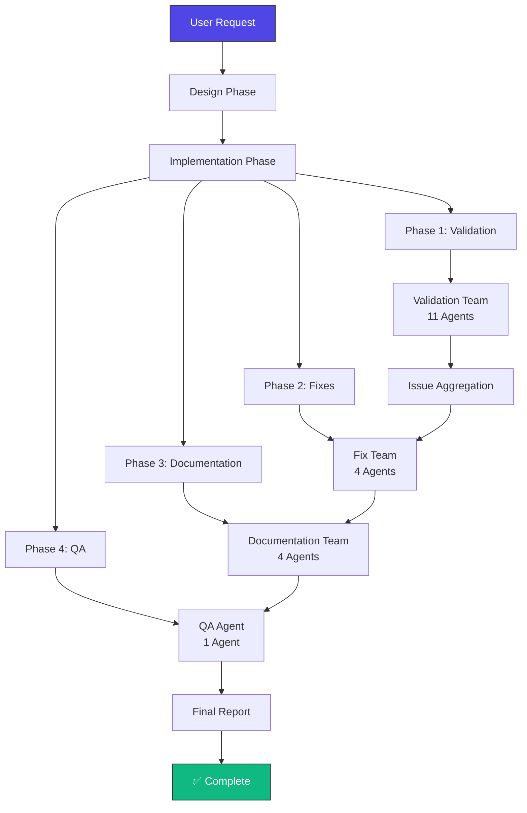
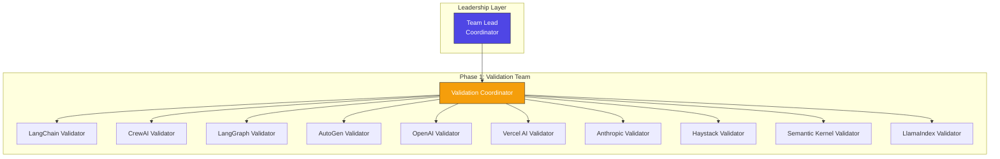
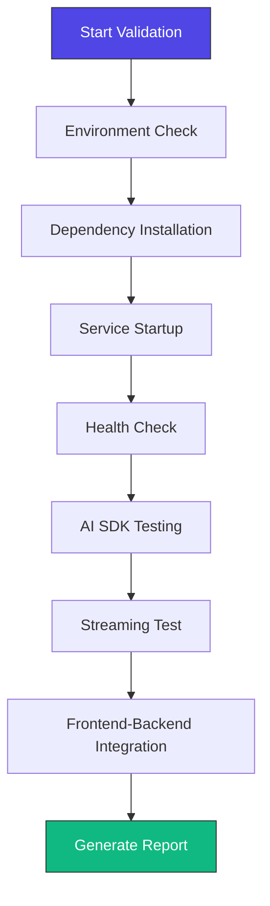
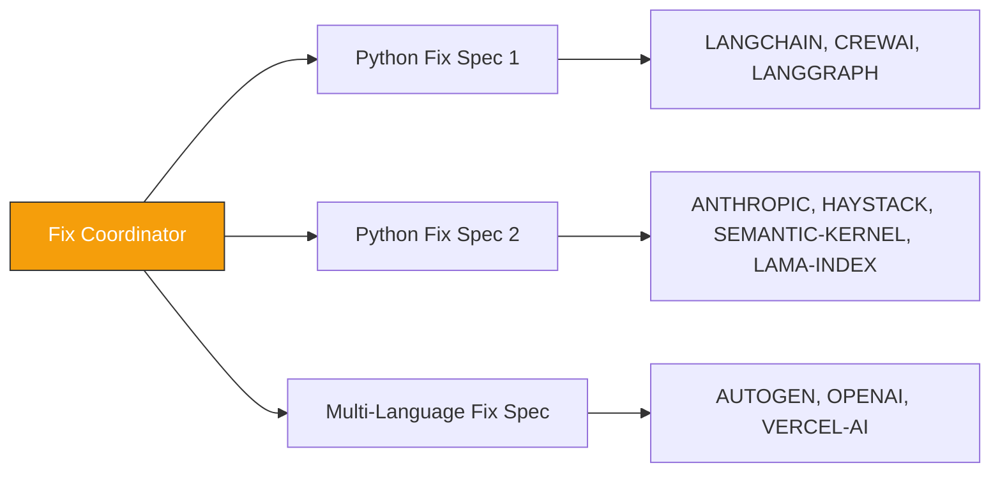
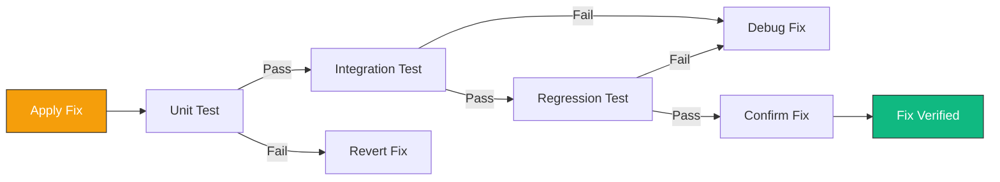
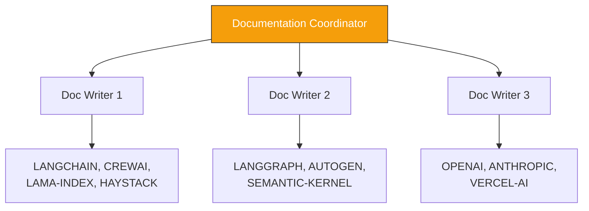
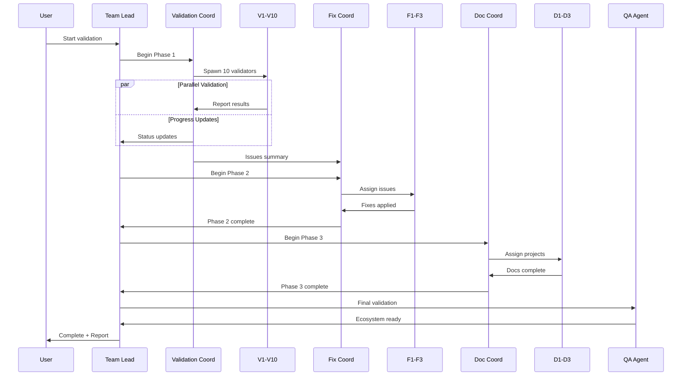

# Multi-Project Validation & Documentation Design

**Date:** 2026-02-24
**Author:** Claude Code Agent Team
**Status:** ✅ Approved
**Type:** Architecture & Implementation Design

---

## Executive Summary

Comprehensive validation and documentation workflow for 10 AI SDK projects using parallel agent teams. The solution validates full integration (frontend ↔ backend ↔ AI SDK), generates complete documentation suites, and resolves all issues in ~2-3 hours.

### Key Requirements
- **Validation Level:** Full integration testing (frontend ↔ backend ↔ AI SDK)
- **Documentation Level:** Full suite (README + API docs + deployment + testing + contribution guides)
- **Workflow:** Parallel phases using agent teams
- **Focus:** AI SDK integration (API keys, LLM calls, streaming, orchestration, error handling)

---

## Architecture Overview



---

## Projects Overview

| Project | Stack | AI SDK | Validator Agent |
|---------|-------|--------|-----------------|
| AI-SDK-LANGCHAIN | Next.js 15 + FastAPI | LangChain | langchain-validator |
| AI-SDK-CREWAI | React 19 + FastAPI | CrewAI | crewai-validator |
| AI-SDK-LANGGRAPH | SvelteKit + Node.js | LangGraph | langgraph-validator |
| AI-SDK-AUTOGEN | Vue 3 + .NET 9 | AutoGen | autogen-validator |
| AI-SDK-OPENAI | Angular 19 + Go | OpenAI | openai-validator |
| AI-SDK-VERCEL-AI | Next.js 15 RSC | Vercel AI SDK | vercel-ai-validator |
| AI-SDK-ANTHROPIC | Remix + FastAPI | Anthropic | anthropic-validator |
| AI-SDK-HAYSTACK | Nuxt 3 + Django | Haystack | haystack-validator |
| AI-SDK-SEMANTIC-KERNEL | Astro 5 + Flask | Semantic Kernel | semantic-kernel-validator |
| AI-SDK-LAMA-INDEX | T3 Stack + FastAPI | LlamaIndex | lamaindex-validator |

---

## Phase 1: Parallel Validation

### Team Structure



### Agents (11 total)

| Role | Agent Type | Count | Purpose |
|------|------------|-------|---------|
| Team Lead | general-purpose | 1 | Orchestrate all phases |
| Validation Coordinator | general-purpose | 1 | Spawn and monitor validators |
| Project Validators | e2e-runner | 10 | Test each project |

### Validation Workflow (per validator)



### Test Categories

**1. Smoke Tests**
```bash
# Backend starts
cd backend && python main.py &

# Frontend starts
cd frontend && npm run dev &

# Health endpoint responds
curl -f http://localhost:8000/health
curl -f http://localhost:3000
```

**2. Dependency Tests**
```bash
# Python
pip install -r requirements.txt --dry-run
python -c "import langchain; print('OK')"

# Node.js
npm list --depth=0
```

**3. AI SDK Integration Tests**
```bash
curl -X POST http://localhost:8000/api/agent/execute \
  -H "Content-Type: application/json" \
  -d '{"input": "test"}'
```

**4. Streaming Tests**
```bash
timeout 10 curl -N http://localhost:8000/api/stream \
  -H "Content-Type: application/json" \
  -d '{"prompt": "test"}'
```

**5. Frontend-Backend Integration**
```bash
curl http://localhost:3000/api/health
```

**6. Error Handling Tests**
```bash
# Test missing API key
curl -X POST http://localhost:8000/api/chat -d '{}'

# Test invalid input
curl -X POST http://localhost:8000/api/chat -d '{"message": ""}'
```

### Output

- 10 validation reports
- Aggregated issue list (categorized by severity)
- Status dashboard

**Duration:** ~30-45 minutes

---

## Phase 2: Parallel Fixes

### Team Structure



### Agents (4 total)

| Role | Agent Type | Projects | Purpose |
|------|------------|----------|---------|
| Fix Coordinator | build-error-resolver | All | Coordinate fixes |
| Python Fix Specialist 1 | python-reviewer + build-error-resolver | LANGCHAIN, CREWAI, LANGGRAPH | Python/FastAPI fixes |
| Python Fix Specialist 2 | python-reviewer + build-error-resolver | ANTHROPIC, HAYSTACK, SEMANTIC-KERNEL, LAMA-INDEX | Python/Django/Flask fixes |
| Multi-Language Fix Specialist | build-error-resolver | AUTOGEN, OPENAI, VERCEL-AI | .NET/Go/Node.js fixes |

### Issue Categories

| Severity | Examples | Action |
|----------|----------|--------|
| Critical | Services won't start, AI calls fail entirely | Fix immediately |
| High | Missing dependencies, broken endpoints | Fix before Phase 3 |
| Medium | Warnings, inefficient patterns | Fix when possible |
| Low | Style issues, minor optimizations | Document only |

### Fix Verification



**Duration:** ~30-60 minutes

---

## Phase 3: Parallel Documentation

### Team Structure



### Agents (4 total)

| Role | Agent Type | Projects | Purpose |
|------|------------|----------|---------|
| Documentation Coordinator | doc-updater | All | Coordinate documentation |
| Doc Writer 1 | doc-updater + docs-architect | LANGCHAIN, CREWAI, LAMA-INDEX, HAYSTACK | Python AI SDK docs |
| Doc Writer 2 | doc-updater + docs-architect | LANGGRAPH, AUTOGEN, SEMANTIC-KERNEL | Multi-agent SDK docs |
| Doc Writer 3 | doc-updater + docs-architect | OPENAI, ANTHROPIC, VERCEL-AI | Official SDK docs |

### Documentation Deliverables (Per Project)

```yaml
AI-SDK-{PROJECT}/
├── README.md  # Enhanced with:
│   ├── Project badges
│   ├── Architecture diagram (Mermaid)
│   ├── Quick start guide
│   ├── Tech stack details
│   ├── AI SDK integration details
│   ├── API endpoints table
│   ├── Usage examples
│   ├── Screenshots/demo links
│   └── Troubleshooting section
├── docs/
│   ├── API.md           # All endpoints, schemas, auth, error codes
│   ├── DEPLOYMENT.md    # Platform instructions, env vars, build commands
│   └── TESTING.md       # Test structure, commands, coverage, CI/CD
└── CONTRIBUTING.md      # Enhanced: dev setup, code style, PR process
```

### Documentation Quality Checks

```yaml
README.md:
  - Has badges: ✅
  - Has architecture diagram: ✅
  - Has quick start: ✅
  - Has API endpoints: ✅
  - Has troubleshooting: ✅
  - Links are valid: ✅
  - Code examples are runnable: ✅

API.md:
  - All endpoints documented: ✅
  - Request/response schemas: ✅
  - Authentication details: ✅
  - Error codes listed: ✅

DEPLOYMENT.md:
  - Platform instructions: ✅
  - Environment variables: ✅
  - Build commands: ✅
  - Verification steps: ✅

TESTING.md:
  - Test structure: ✅
  - Run commands: ✅
  - Coverage info: ✅
```

**Duration:** ~45-60 minutes

---

## Phase 4: Final QA

### Agent (1 total)

| Role | Agent Type | Purpose |
|------|------------|---------|
| QA Specialist | code-review + pr-review-toolkit:code-reviewer | Final validation |

### QA Checklist

```yaml
Validation:
  - All 10 projects start: ✅
  - All health checks pass: ✅
  - All AI endpoints respond: ✅
  - Frontend-backend integration works: ✅
  - All docs are complete: ✅
  - Formatting is consistent: ✅
  - No critical issues remain: ✅
```

**Duration:** ~15-20 minutes

---

## Error Handling Strategy

### Error Categories & Handling

| Error Type | Example | Handler | Retry? | Fallback |
|------------|---------|---------|--------|----------|
| Network | API timeout, connection refused | Exponential backoff | ✅ Yes (3x) | Skip test, mark warning |
| Dependency | Module not found, version conflict | Install/upgrade | ✅ Yes (2x) | Document blocker |
| Service | Port in use, crash on start | Kill process, restart | ✅ Yes (2x) | Use alternative port |
| API Key | Missing/invalid credentials | Skip AI tests | ❌ No | Mock response |
| Timeout | Service takes too long | Increase timeout | ✅ Yes (1x) | Mark as slow |
| Critical | Corrupted files, syntax error | Report immediately | ❌ No | Mark blocker |

### Retry Logic

```python
MAX_RETRIES = 3
BASE_DELAY = 1000  # ms

def execute_with_retry(task):
    for attempt in range(MAX_RETRIES):
        try:
            return task.execute()
        except RetryableError as e:
            if attempt < MAX_RETRIES - 1:
                delay = BASE_DELAY * (2 ** attempt)
                sleep(delay)
            else:
                return FallbackResult(e)
```

### Graceful Degradation

**✅ DO:**
- Log detailed error context
- Continue with remaining tests
- Mark affected tests as "skipped" with reason
- Provide actionable error messages
- Suggest fixes

**❌ DON'T:**
- Crash entire validation
- Lose progress from successful tests
- Return generic error messages
- Block other agents

---

## Communication Flow



---

## Agent Summary

| Phase | Agents | Agent Types |
|-------|--------|-------------|
| Leadership | 1 | `general-purpose` |
| Phase 1: Validation | 11 | `e2e-runner`, `general-purpose` |
| Phase 2: Fixes | 4 | `build-error-resolver`, `python-reviewer` |
| Phase 3: Documentation | 4 | `doc-updater`, `octo:docs-architect` |
| Phase 4: QA | 1 | `code-review`, `pr-review-toolkit:code-reviewer` |
| **Total** | **20 Agents** | |

---

## Superpowers Used

| Superpower | Purpose | Phase |
|------------|---------|-------|
| `superpowers:brainstorming` | Initial design | Planning |
| `superpowers:writing-plans` | Implementation plan | Planning |
| `everything-claude-code:e2e-runner` | End-to-end testing | Validation |
| `everything-claude-code:build-error-resolver` | Fix build errors | Fixes |
| `everything-claude-code:python-reviewer` | Python code review | Fixes |
| `everything-claude-code:doc-updater` | Documentation generation | Documentation |
| `octo:docs-architect` | Technical documentation | Documentation |
| `superpowers:code-review` | Final code review | QA |
| `pr-review-toolkit:code-reviewer` | PR review standards | QA |

---

## Success Metrics

### Quantitative
```yaml
Projects: 10/10 validated ✅
Services: 10/10 starting ✅
AI Endpoints: 10/10 responding ✅
Documentation: 50/50 files generated ✅
Issues: 0 critical remaining ✅
Time: ~2-3 hours total ✅
```

### Qualitative
```yaml
- All projects have consistent documentation
- All AI SDK integrations are functional
- All frontend-backend communication works
- Ecosystem is deployment-ready
- Issues are well-documented and resolved
```

---

## Risk Mitigation

| Risk | Mitigation |
|------|------------|
| Agent crashes | Retry logic + fallback handlers |
| API key missing | Mock responses for testing |
| Port conflicts | Auto-detect available ports |
| Dependency conflicts | Isolated environments per project |
| Timeout | Configurable timeouts with retries |
| Documentation inconsistencies | Template-based generation |

---

## Next Steps

1. ✅ **Design Document** (This file)
2. **Invoke Writing-Plans Skill** - Create detailed implementation plan
3. **Execute Implementation** - Create team, spawn agents, monitor progress
4. **Final Delivery** - Complete ecosystem report, deployment ready

---

## Appendix: Test Data & Mocking

### Mock AI Responses

```python
MOCK_AI_RESPONSE = {
    "status": "success",
    "message": "This is a mock response for testing",
    "provider": "mock",
    "timestamp": "2026-02-24T12:00:00Z"
}

# Use in tests
if not os.getenv("OPENAI_API_KEY"):
    return MOCK_AI_RESPONSE
```

### Test Prompts

```yaml
simple_prompts:
  - "Hello"
  - "Test message"
  - "Say 'OK'"

ai_prompts:
  - "What is AI?"
  - "Explain machine learning"
  - "Write a haiku about code"

streaming_prompts:
  - "Count to 10"
  - "List 5 colors"
  - "Tell a short story"

error_prompts:
  - ""  # Empty
  - "A" * 10000  # Too long
  - "<script>alert('xss')</script>"  # XSS attempt
```

---

**End of Design Document**
